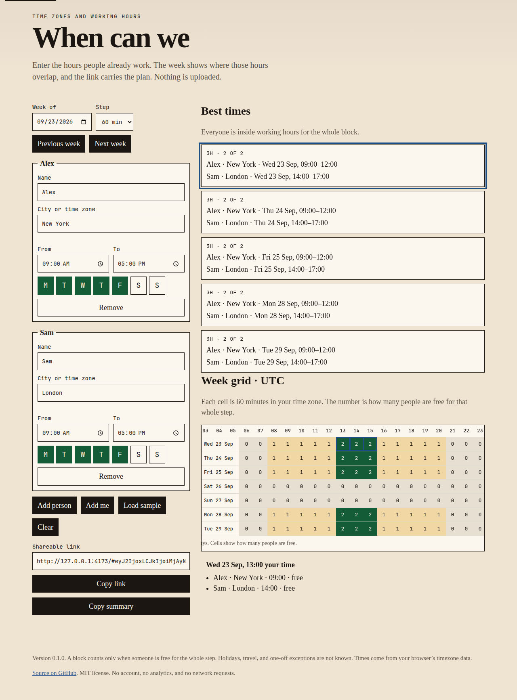
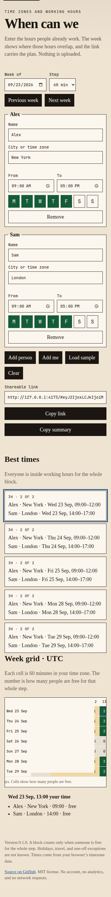

# When Can We

Find the hours that already fit everyone’s working day, including people in other time zones.

You type a city and the hours someone works. The week shows where those hours overlap. Send the link. The plan stays in the link and in the browser that opened it. There is no account and no upload.



## Try it

Download [whencanwe.html](https://github.com/macodev00/Idk-yet-let-grok-decide/releases/latest/download/whencanwe.html) and open it. That file runs offline.

A hosted copy can live at [macodev00.github.io/Idk-yet-let-grok-decide](https://macodev00.github.io/Idk-yet-let-grok-decide/). Publishing it takes one repository setting: **Settings → Pages → Build and deployment → Source → GitHub Actions**. The Pages workflow deploys the site after that.

From a checkout:

```sh
python3 -m http.server 4173
```

Then open `http://127.0.0.1:4173/`. Opening `index.html` directly does not load its modules. The release file does not have that limit.

The first visit shows the current week for a sample team: Alex in New York and Sam in London, 09:00–17:00 on weekdays. For the week of 23 September 2026 that overlap is 09:00–12:00 in New York and 14:00–17:00 in London. Change any field and the plan is saved on this computer.

## Command line

The same rules are available without the page. Node.js 20 or newer:

```sh
node bin/whencanwe.js \
  --date 2026-09-23 \
  --person "Alex|America/New_York|09:00|17:00" \
  --person "Sam|Europe/London|09:00|17:00"
```

```text
Everyone can make these times:

Alex (America/New_York): Wed 23 Sep, 09:00–12:00
Sam (Europe/London): Wed 23 Sep, 14:00–17:00
```

The command exits 0 when at least one block fits everyone, and 1 when it only found a compromise. `--step 30` uses half hours. Days default to Monday–Friday. A fifth field sets the days, Monday first: `1111100`.

## How a block is chosen

- The grid is seven days in **your** time zone, starting on the date you pick.
- Each person’s hours are interpreted in **their** time zone.
- A step counts only when they are free for that whole step. A 60-minute step that runs past the end of their day is not counted.
- Day buttons are Monday through Sunday. Turn a day off and that person’s hours do not apply then.
- A shift that crosses midnight, such as 22:00–06:00, continues into the next morning when the day the shift started is on.
- If nobody shares a block, the page lists the closest overlaps and names who would be outside their hours.
- On the day clocks spring forward, the missing hour is skipped. On the day they fall back, the repeated hour is shown once.

Cities use the IANA names in `src/cities.js`. You can also type a name directly, such as `America/Chicago`.

## What it does not do

It does not know holidays, travel, or a one-off exception. It does not book a meeting or talk to a calendar. It is not a poll: if you do not already know someone’s hours, a tool such as When2meet is a better fit, because this one will not ask them to click a grid.

## Privacy

The page does not send the plan anywhere. The share link keeps it in the URL hash, and browsers do not include the hash in the request for the page. A copy is also stored in `localStorage` under `whencanwe.v1` so a refresh on the same computer comes back.

Anyone with the link can read it. Do not put secrets or home addresses in the name fields. The Content-Security-Policy does not allow the page to make network requests.

## Development

```sh
node --test
node scripts/build-standalone.js
```

Tests cover the New York / London overlap, overnight shifts, rejected links, and the single-file build. Daylight-saving offsets come from Node or the browser, including the weeks when New York and London are four hours apart instead of five. See [CONTRIBUTING.md](CONTRIBUTING.md).



## License

[MIT](LICENSE). Copyright (c) 2026 macodev00.
